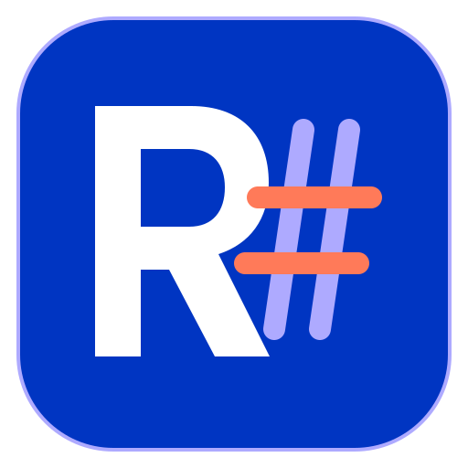

<p align="center">
  
</p>

<h1 align="center">RustSharp</h1>

<p align="center">A Rust-compatible language toolchain for .NET.</p>

<p align="center">
  <a href="README.md">English</a> | <a href="README_zh.md">简体中文</a>
</p>

<p align="center">
  <a href="https://github.com/IoTSharp/RustSharp/actions/workflows/windows-p0.yml"></a>
  <a href="https://github.com/IoTSharp/RustSharp/actions/workflows/linux-native-aot.yml"></a>
  
</p>

> **🚧 In progress:** RustSharp is experimental. Compatibility is declared by named profiles, not by a claim of full Rust support. Unsupported source is rejected with diagnostics instead of being silently assigned C# or CLR semantics.

RustSharp is implemented in C# on .NET 10 and targets a deliberately scoped Rust 1.98 / Edition 2024 language implementation. The `rsc` compiler consumes `.rs` source files and the supported subset of `Cargo.toml` package inputs, emits ECMA-335 assemblies and Portable PDB files, and can run on CoreCLR or publish through .NET Native AOT for covered profiles.

## What works today

| Area | Current scope |
| --- | --- |
| `vertical-slice-v1` | The default profile: `fn main()` with literal `println!` statements. |
| `safe-core-primitives-v1` | An opt-in profile with bounded file modules and local `path` packages, nongeneric functions, `i32` / `bool`, initialized mutable locals, `if` / `else`, returns, checked arithmetic, comparisons, boolean operators, and `println!`. |
| `safe-core-types-v1` | An opt-in, check-only type profile: primitive numeric types, tuples, arrays, slices, references, function pointers, nongeneric ADTs, aliases, patterns/match, closures, bounded const evaluation, inference and directional coercions. It does not check borrowing or emit executable output. |
| `safe-core-generics-v1` | An opt-in executable generic profile: rigid type-parameter body checking, explicit/inferred calls, marker-trait bounds and impl coherence, tuples and generic structs, and closed body specialization through CLR LIR to IL and Native AOT. |
| Output | Direct ECMA-335 and Portable PDB emission, CoreCLR execution, and Native AOT publishing for covered profiles. |

RustSharp is not a drop-in replacement for `rustc`. Full Rust compatibility, standard-library parity, general Cargo registry resolution, macro expansion, ownership and borrow checking, Rust ABI compatibility, and arbitrary `unsafe` code are not current commitments. See the [compatibility contract](docs/compatibility.md) for exact boundaries.

## Quick start

Install .NET SDK 10.0.400 first. The repository pins that version in [global.json](global.json) and disables roll-forward. Rust 1.98.0 is only required when running differential conformance work.

```text
git clone https://github.com/IoTSharp/RustSharp.git
cd RustSharp
dotnet restore RustSharp.slnx
dotnet build RustSharp.slnx -c Release --no-restore
dotnet run --project src/RustSharp.Cli -c Release --no-build --no-restore -- run samples/safe-core.rs --profile safe-core-primitives-v1
```

The sample prints a small `i32` / `bool` program compiled by RustSharp.

## CLI

The installed CLI is named `rsc`. From a source checkout, inspect the complete option list with:

```text
dotnet run --project src/RustSharp.Cli -c Release --no-build --no-restore -- --help
```

Its current command surface is:

```text
rsc check <source.rs|Cargo.toml> [--profile <name>]
rsc build <source.rs|Cargo.toml> [--output <program.dll>] [--profile <name>]
rsc compile <source.rs|Cargo.toml> [--output <program.dll>] [--profile <name>]
rsc run <source.rs|Cargo.toml> [--output <program.dll>] [--timeout <seconds>] [--profile <name>]
rsc publish <source.rs|Cargo.toml> [--runtime <rid>] [--output <directory>] [--timeout <seconds>] [--profile <name>]
```

`compile` is retained as a compatibility alias for `build`.

Use `rsc check samples/type-system.rs --profile safe-core-types-v1` for the
type-system sample. This profile accepts `check`; executable commands report
`RSC0009` before creating output. See the [type-system contract](docs/type-system-profile.md)
for its scope and the separate lifetime/borrow-checking boundary.

P1-04 is ✅ Complete for this declared monomorphic type contract. The recorded
Windows x64 gate passes 265/265 regressions and 96/96 rustc differential cases
across sixteen required categories, with zero failures or skips.

P1-05 is ✅ Complete for its declared bounded contract. `safe-core-generics-v1` checks generic bodies through
name-bound HIR, specializes reachable bodies and aggregate layouts, and supports
`check`, `build`, `compile`, `run` and `publish`. The
[generic contract](docs/generic-profile.md) defines the bounded marker-trait
subset and fixed 32-case rustc corpus, including eight execution comparisons
and five explicit profile-boundary rejections.
The recorded 2026-09-19 profile gate passes 350/350 regressions and 32/32 fixed
cases, with ILVerify plus Windows x64 Native AOT for both standalone and local
Cargo package samples. After the P1-05 merge, the executable harness registers
and passes 377/377 tests; this supplemental run used the installed 10.0.401 SDK
through explicit MSBuild and does not replace the recorded 10.0.400 AOT
evidence.

P1-06 through P1-10 and the P1 stage remain 🚧 In progress. The opt-in
`safe-core-mir-p1-v2` profile adds structural-`Copy` repeated arrays, bounded
tuple/scalar patterns, guarded/or-pattern `match`, and statically expanded
captured closures to source-mapped HIR → typed MIR → CLR LIR emission. The v1
repeated-array rejection remains unchanged. The pipeline has deterministic
snapshots and PE/PDB checks, explicit unsupported diagnostics, and bounded
work, size, depth, time and cancellation behavior.

Full-array local slice references now support array-to-slice unsizing, `.len()`
and constant indexing through proven owner storage, with CoreCLR regressions.
Dynamic indexing, subslices, slice writes and general slice parameters/returns
remain unsupported.

Bounded direct-local borrow/reborrow origins, place/projection models and
ownership evidence now flow through typed MIR and the CLR LIR backend. Shared
reference copies clone their loan, mutable reference moves transfer it, and
source escapes receive stable ownership diagnostics. The adapter maps non-`Copy`
MIR uses to moves and checks projected move paths; complete source place lowering,
interprocedural contracts and the complete NLL join space remain open. The
supported unit `impl Drop` path now emits explicit MIR destructor calls and
ownership Drop facts, with generated fault cleanup exercised on CoreCLR. Complete
panic/unwind/abort behavior, destructor-failure continuation and field-owning
aggregates remain open. Cross-package
scalar calls already use AssemblyRef/TypeRef/MemberRef and strict MethodDef
signature/static/visibility checks. Imported aggregate/byref signatures and call
contracts now have metadata and manually constructed CLR LIR producer/consumer
CoreCLR tests; full source-level cross-package ownership contracts and evidence
for these additions on ILVerify and both Native AOT platforms remain open.

The current local Release build has zero errors/warnings, and the executable harness passes 464/464 with zero failures/skips. This is local evidence for the current changes, not the complete P1 exit gate.

The recorded `safe-core-regression-v1` report passes 8/8 with zero failures or
skips. The versioned `safe-core-regression-v2` report passes 24/24 with one
compile-pass, six compile-fail, thirteen run-pass and four differential cases;
its rustc 1.98.0 process records have zero failures, blocked cases or skips.
`p1-exit-gate-v1` passes 5/5 in-process library probes and explicitly
records `"nativeAot": false` and `"crossPlatform": false`. The immutable
`p1-differential-v2` manifest executes 16/16 cases (10 borrow, 6 Drop) against
rustc 1.98.0 with zero failures, blocked cases or skips. The new
`p1-platform.yml` workflow fixes 12 run-pass cases per native Windows/Linux x64
runner, runs the 24-case v2 regression suite on each platform, and aggregates
six reports covering CoreCLR, ILVerify, Native AOT, differential and regression
evidence. [Run 35848782833](https://github.com/IoTSharp/RustSharp/actions/runs/35848782833)
passed all six gates at historical commit `23279d93267a814c643baddc29c72918ff0fda0b`.
That run does not validate the subsequent additions described above; the P1
milestone remains open for the semantic and final-commit evidence gaps.

Local hello probes provide ILVerify, CoreCLR and Windows x64 Native AOT
evidence. Linux x64 Native AOT hello also runs under Ubuntu WSL2 with SDK
10.0.112; the native Linux probe explicitly excludes WSL2 from its native-host
claim. Neither result proves the full P1 language surface. Completion requires
the expanded fixed denominators on CoreCLR, ILVerify, native Windows/Linux
x64 AOT and rustc 1.98, with zero failures/skips and CI at the final pushed SHA.
The [P1 gap matrix](docs/p1-gap-matrix.md) maps every remaining requirement to
implementation, tests, local evidence and CI evidence; the
[typed MIR contract](docs/typed-mir-profile.md) defines the implemented boundary.

Run the generic sample, which prints `42` and `true`, with:

```text
dotnet run --project src/RustSharp.Cli -c Release --no-build --no-restore -- run samples/generics.rs --profile safe-core-generics-v1
dotnet run --project src/RustSharp.Cli -c Release --no-build --no-restore -- run tests/workspaces/generics/Cargo.toml --profile safe-core-generics-v1
```

The Cargo sample produces the same output using a local dependency's generic
`Container<T>` and function body, plus a foreign marker trait implemented for a
local struct. Its source-linked generic definitions are persisted in the output
assembly's `RustSharp.Generics.v1.json` resource.

## Repository guide

| Path | Purpose |
| --- | --- |
| [src](src) | Compiler, syntax, semantic, IL code generation, runtime, and CLI projects. |
| [samples](samples) | Small RustSharp programs for execution and type checking. |
| [tests](tests) | Bounded executable regression harness. |
| [docs](docs) | Compatibility contracts and architecture decisions. |

## Documentation

- [Compatibility contract](docs/compatibility.md): declared language and runtime boundaries.
- [Language contracts](docs/lexical-profile.md): lexical, [syntax](docs/syntax-profile.md), [module](docs/module-profile.md), and [type-system](docs/type-system-profile.md) profile details.
- [Roadmap](ROADMAP.md): parent milestones and recorded evidence; the [granular execution plan](docs/roadmap/README.md) covers all P0–P6 phases with 365 implementation leaves and 32 explicit gate leaves. Each leaf has its own deliverable, dependencies, acceptance and evidence, so completed subsets can close without claiming that a whole phase is complete.
- [Architecture decisions](docs/adr): decisions that constrain the implementation, including the [safe-core primitive profile](docs/adr/0007-safe-core-primitives.md).

## Development

After a Release build, run the bounded executable harness with:

```text
dotnet run --project tests/RustSharp.Tests/RustSharp.Tests.csproj -c Release --no-build --no-restore
```

This repository does not currently use a Test SDK-based `dotnet test` suite.

## Contributing

Before proposing a language behavior change, read the relevant compatibility contract and ADR. Keep implementation, tests, and affected documentation aligned in the same change.

## Notices

[LICENSE-UNICODE](LICENSE-UNICODE) is included in this repository. Its scope and terms are stated in that file.
